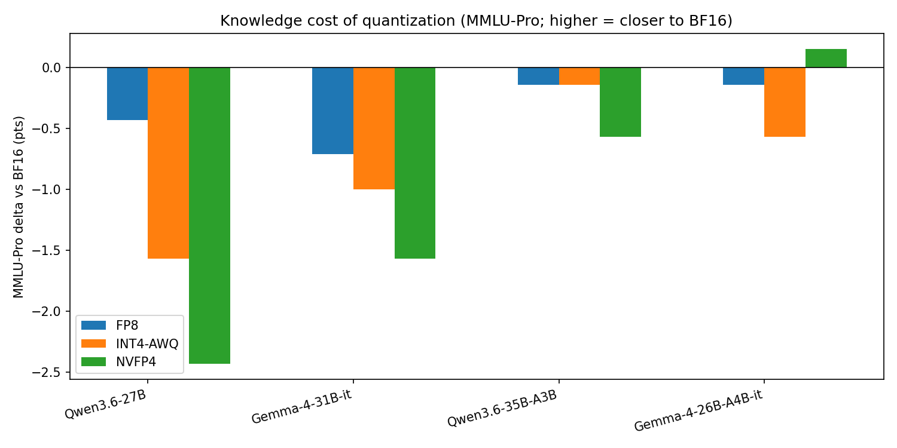
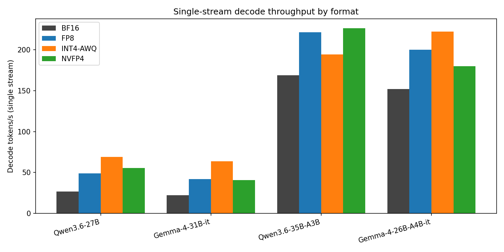
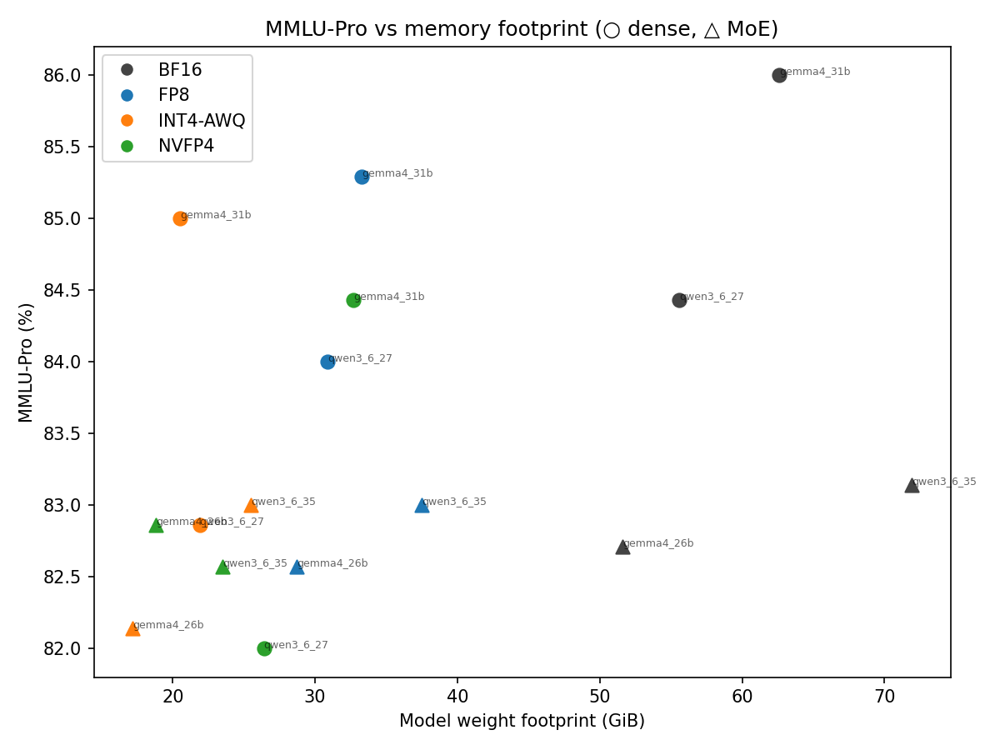

# Benchmarking NVFP4: what 4-bit really costs on a Blackwell workstation

*A reproducible quality-and-throughput study of FP8, INT4 (AWQ) and NVFP4 against
BF16, across two dense and two Mixture-of-Experts models.*

**Status:** Results complete — all 16 arms measured (quality + single-stream throughput);
tables and figures are generated from `results/` by the committed scripts. The entire pipeline
is public and rebuildable end-to-end — **<https://github.com/sch0tten/nvfp4-benchmark>** (§3.7) —
and we invite you to run it yourself. No number appears in this report that is not backed by a
committed run log or an explicitly cited source.

---

## Abstract

We benchmark four numeric formats — BF16, FP8, INT4-AWQ and NVFP4 — across sixteen arms (two
dense and two Mixture-of-Experts instruction-tuned models, each in all four formats) on a single
96 GB NVIDIA Blackwell workstation, using the most-downloaded real-world quantization of each
model rather than idealized in-house ones. On quality — measured generatively under one identical
protocol with the EleutherAI harness — four bits is nearly free: averaged over five tasks, NVFP4's
cost is at most 0.6 points (the dense models) and the MoE models give up even less, and that cost
is concentrated almost entirely in knowledge (MMLU-Pro); math, code and instruction-following sit
at a ceiling. NVFP4 and INT4-AWQ are a wash at equal ~½ byte per parameter — which one wins is
decided by the quantization recipe, not the number format. On throughput in the single-stream
regime, the dominant lever is architecture: the MoE arms decode 3–7× faster than the dense ones,
and within a model INT4-AWQ's mature kernels usually edge NVFP4 on decode while NVFP4 holds the
smallest weight footprint. With no access to NVIDIA's harness, our independently-measured BF16→NVFP4
deltas reproduce NVIDIA's published deltas to within 0.6 points on three of four benchmarks — and to
0.03 on the Qwen-MoE. The practical verdict for a local agentic deployment: run a 4-bit MoE; take
INT4-AWQ for peak tokens-per-second today and the official NVFP4 for the smallest memory and the
format Blackwell was built around.

## 1. Why this study, and why now

For an executive yet physics-literate reader, the interesting thing about NVIDIA's
Blackwell generation is not that it is fast — it is *what it chose to make cheap*.
Classical computing treated the byte as the indivisible unit of useful work.
Blackwell's hardware makes the **nibble** — four bits — a first-class citizen of the
tensor core, and pairs it with a small per-block scale so that a 4-bit number can
still track the dynamic range of a transformer's weights and activations. That is
the essence of **NVFP4**: a 4-bit floating-point format (E2M1) with a shared FP8
(E4M3) micro-scale every 16 elements.

The promise is seductive: a model that needed ~2 bytes per weight now needs ~half a
byte, so a 30-billion-parameter model that wanted 60 GB now fits in ~16–18 GB, and
the tensor cores do the 4-bit math at much higher arithmetic throughput. The
question this report answers, empirically and reproducibly, is the one that actually
matters for deployment: **how much capability do you give up to get that, and how
much speed do you gain — for the models people actually run locally, on hardware
that is neither a hyperscaler nor a hobbyist's gaming PC?**

We deliberately study a *hybrid* environment — a single 96 GB Blackwell workstation
(`ai02`) — and we use the **most-downloaded real-world quantizations** of each model,
not idealized in-house ones, because that is what a practitioner deploys.

## 2. Background: the four formats

- **BF16** — the 16-bit reference. Full quality, full memory (~2 bytes/param).
- **FP8 (E4M3)** — 8-bit float, typically block-wise scaled. ~1 byte/param.
- **INT4 / AWQ** — 4-bit *integer* weights with per-group scales; Activation-aware
  Weight Quantization protects salient channels. ~0.5 byte/param (weights), but
  activations stay in higher precision and attention is often kept higher-precision.
- **NVFP4** — 4-bit *float* (E2M1) weights **and** activations with FP8 micro-scales
  every 16 elements, executed natively on Blackwell tensor cores. ~0.5 byte/param.

The key distinction the paper keeps returning to: INT4-AWQ is a *weight-only-ish*
integer scheme; NVFP4 is a *floating-point, weight-and-activation* scheme designed
around the hardware. They are not the same kind of "4-bit."

## 3. Methodology

### 3.1 Hardware & engine
*(See `configs/models.yaml › meta`.)* NVIDIA RTX PRO 6000 Blackwell Max-Q, 96 GB
(sm_120), CUDA 13.2, driver 595.71.05; Xeon w3-2423, 125 GB RAM. Engine: vLLM 0.22.1,
torch 2.11.0, transformers 5.10.2, compressed-tensors 0.15.0.1, flashinfer 0.6.11
(exact lockfile: `env/requirements.lock.txt`).

### 3.2 Models — four "seeds" × four formats (16 arms)
Two dense and two MoE instruction-tuned models, each in BF16/FP8/INT4-AWQ/NVFP4.
Every arm is the most-downloaded official/community quant for that exact model and is
pinned to a commit SHA. **Three of the four NVFP4 arms are official NVIDIA Model
Optimizer releases.** Full table with sizes, download counts, provenance and exact
per-layer recipes: `configs/models.yaml`.

**Table 1 — the 16-arm matrix.** Each arm is the most-downloaded real-world quant of that exact
model, pinned to a commit SHA (full SHAs + per-layer recipes in `configs/models.yaml`).

| Model | Type | Format | Hugging Face repo | Provenance |
|---|---|---|---|---|
| Qwen3.6-27B | dense | BF16 / FP8 | `Qwen/Qwen3.6-27B`, `…-FP8` | official |
|  |  | INT4-AWQ | `QuantTrio/Qwen3.6-27B-AWQ` | community |
|  |  | NVFP4 | `unsloth/Qwen3.6-27B-NVFP4` | community |
| Gemma-4-31B-it | dense | BF16 | `google/gemma-4-31B-it` | official |
|  |  | FP8 / INT4-AWQ | `RedHatAI/…-FP8-block`, `QuantTrio/…-AWQ` | Neural Magic / community |
|  |  | NVFP4 | `nvidia/Gemma-4-31B-IT-NVFP4` | **official NVIDIA** |
| Qwen3.6-35B-A3B | MoE | BF16 / FP8 | `Qwen/Qwen3.6-35B-A3B`, `…-FP8` | official |
|  |  | INT4-AWQ | `QuantTrio/Qwen3.6-35B-A3B-AWQ` | community |
|  |  | NVFP4 | `nvidia/Qwen3.6-35B-A3B-NVFP4` | **official NVIDIA** |
| Gemma-4-26B-A4B-it | MoE | BF16 | `google/gemma-4-26B-A4B-it` | official |
|  |  | FP8 / INT4-AWQ | `RedHatAI/…-FP8-Dynamic`, `cyankiwi/…-AWQ-4bit` | Neural Magic / community |
|  |  | NVFP4 | `nvidia/Gemma-4-26B-A4B-NVFP4` | **official NVIDIA** |

### 3.3 Recipe heterogeneity (read this before the results)
"FP8", "INT4" and "NVFP4" are **not byte-identical recipes** across models. NVIDIA's
Gemma-dense NVFP4 keeps most attention layers in BF16; the Qwen-dense NVFP4 (unsloth)
quantizes the whole language model; AWQ keeps attention Q/K/V in BF16; the Qwen-MoE
NVFP4 is explicitly *mixed precision* (linear-attention in FP8, experts in NVFP4).
We therefore frame results as **"best-available quant per format, as deployed,"** not
a pure number-format isolation, and we report each recipe verbatim.

### 3.4 Quality protocol — generative, and validated (not assumed)
EleutherAI lm-evaluation-harness (in-process vLLM). We evaluate **generatively**,
with each model's chat template and **greedy decoding** (temperature 0), in each
arm's *deployed* configuration. This was validated empirically, not assumed.
Loglikelihood multiple-choice scoring — the classic Open-LLM-Leaderboard method —
proved unreliable for these instruction-tuned models: the **BF16 reference**
`google/gemma-4-31B-it` scored only **0.42** acc_norm on ARC-Challenge (25-shot)
versus its true ~0.88. Because the BF16 reference *itself* is broken, this is a
loglikelihood/instruct-model miscalibration (compounded on quantized arms by their
FP8 KV-cache), not a quantization effect. Generative evaluation instead (a) reflects
how these reasoning/agentic models are actually used, (b) matches the protocol NVIDIA
uses for its published numbers — enabling direct cross-validation, and (c) produced
sane results on the same hardware (NVFP4 `gsm8k` = **0.97**).

Suite (knowledge · math · instruction-following · coding): `mmlu_pro` (50 questions per
subject, ~700 items), `gsm8k` (600 items), `ifeval`, `humaneval_instruct` and
`mbpp_instruct` (the last three on their full sets). Two engineering fixes were required for correct chat-model scoring
and ship with the harness: (i) lm-eval's default generation stop (`"\n\n"`)
prematurely truncates chat models — Qwen emitted a one-line preamble and halted
(gsm8k 0.0); stopping on the chat turn-end/EOS instead restores it (gsm8k 0.0 → 1.0);
(ii) coding uses the `*_instruct` task variants, which extract code from chat/markdown
output. `gpqa_diamond` is held out (its dataset is HF-gated) and `aime25` was dropped
(greedy single-pass sits at the floor — 0/15 in validation — giving no degradation
signal). Each task is a resumable per-arm job; identical protocol across all 16 arms;
fixed seed 1234; each model in its native chat behaviour (Qwen reasons in `<think>`
blocks, Gemma answers directly). Comparing an arm to its same-model BF16 reference
isolates the quantization-induced quality delta.
(`scripts/run_quality.py`)

### 3.5 Throughput protocol — single-stream, the low-TTFT regime
Every arm served at `--max-num-seqs 1`, `--max-model-len 65536`. We report, with
warmup and repeats (median over 3): time-to-first-token (TTFT) vs prompt length
(128→32k), decode tokens/s, end-to-end latency, and the on-disk weight footprint —
the practical "does it fit in 96 GB alongside a 64k KV-cache" number. Prefill and
decode are separated by a two-point method (latency at 1 vs 257 output tokens).
(`scripts/run_throughput.py`)

### 3.6 Cross-validation
For the official NVIDIA NVFP4 arms we compare our measured BF16→NVFP4 deltas to the
benchmarks NVIDIA publishes that overlap our suite — chiefly **MMLU-Pro** (and
**IFEval** for the Gemma MoE). Absolute scores differ by protocol; the credibility
anchor is whether the *direction and magnitude of the quantization delta* agree.
(`scripts/cross_validate.py`)

### 3.7 Reproducibility — clone it and run it yourself
The entire study is public, self-contained, and MIT-licensed:
**<https://github.com/sch0tten/nvfp4-benchmark>**. `scripts/download_models.sh` fetches every
arm by pinned SHA (no reliance on any pre-existing cache); the engine is a single pinned lockfile
(`env/requirements.lock.txt`); the runners are resumable and log the model SHA + harness version
per run; **both independent runs are committed** (`results/` and `results-rerun/`, §4.2). On any
Blackwell (sm_120) host, with a Hugging Face read token whose account has accepted Google's Gemma
license, the whole matrix is four commands:

```bash
git clone https://github.com/sch0tten/nvfp4-benchmark && cd nvfp4-benchmark
cp .env.example .env            # add your hf_… read token (Gemma license accepted)
make models                     # all 16 arms, pinned by SHA (~600–700 GB)
make env && make setup          # vLLM 0.22.1 venv + the one-time SM120 toolchain fix
make all                        # quality + arm-12 rescue + throughput + tables & figures
```

We built this to be rebuilt. Anyone — sceptics most of all — can re-run the matrix, dispute a
number, add a model, or swap the engine, and open an issue or a pull request with what they find:
an independent benchmark is only worth the trust others can reconstruct, and this one is
engineered for exactly that.

## 4. Results — quality ("reasoning creep")

All sixteen arms completed under the single protocol of §3.4. Table 2 is the full matrix;
every figure traces to a run log under `results/quality/`. Two cells carry a mark and must
be read before anything is concluded from them.

**Table 2 — per-arm quality.** Generative, greedy, each model in its native chat/thinking
behaviour. Scores are percent. Size is the on-disk weight footprint.

| Model (type) | Format | Size GB | MMLU-Pro | GSM8K | IFEval | HumanEval | MBPP |
|---|---|---|---|---|---|---|---|
| **Qwen3.6-27B** (dense) | BF16 | 55.6 | 84.4 | 97.2 | 30.5 | 96.3 | 83.4 |
|  | FP8 | 30.9 | 84.0 | 98.2 | 30.5 | 97.6 | 83.8 |
|  | INT4-AWQ | 21.9 | 82.9 | 98.2 | 30.5 | 96.3 | 82.0 |
|  | NVFP4 | 26.4 | 82.0 | 96.7 | 30.9 | 95.7 | 83.8 |
| **Gemma-4-31B-it** (dense) | BF16 | 62.6 | 86.0 | 96.7 | 91.3 | 93.3 | 70.4 |
|  | FP8 | 33.3 | 85.3 | 96.7 | 91.1 | 90.9 | 71.4 |
|  | INT4-AWQ | 20.5 | 85.0 | 96.3 | 90.0 | 92.1 | 70.0 |
|  | NVFP4 | 32.7 | 84.4 | 96.5 | 90.6 | 93.3 | 69.8 |
| **Qwen3.6-35B-A3B** (MoE) | BF16 | 71.9 | 83.1 | 95.0 | 30.1 | 97.0 | 80.4 |
|  | FP8 | 37.5 | 83.0 | 96.0 | 30.9 | 96.3 | 79.0 |
|  | INT4-AWQ | 25.5 | 83.0 | 96.3 | 30.7 | 95.7 | 80.8 |
|  | NVFP4 ‡ | 23.5 | 82.6 | 96.7 | 30.5 | 93.9 | 79.4 |
| **Gemma-4-26B-A4B-it** (MoE) | BF16 | 51.6 | 82.7 | 95.2 | 89.5 | 10.4 † | 25.4 † |
|  | FP8 | 28.7 | 82.6 | 95.0 | 88.9 | 14.0 † | 21.0 † |
|  | INT4-AWQ | 17.2 | 82.1 | 95.3 | 87.6 | 11.0 † | 17.6 † |
|  | NVFP4 | 18.8 | 82.9 | 96.3 | 89.8 | 13.4 † | 27.2 † |

**† The Gemma-4-26B-A4B (MoE) coding scores are a decoding artifact, not a capability or a
quantization signal.** We inspected the raw generations: under greedy decoding this
3.8B-active model collapses into repetition loops on open-ended code (one completion emits
`thought-process-of-finding-1` to the token cap). The collapse is uniform across all four
formats *including BF16*, and the dense Gemma-4-31B scores 93.3/70.4 on the identical
protocol — so it is a model × greedy-decoding failure mode, not a four-bit effect. We report
the numbers and exclude this model's coding from its quantization deltas. Sampling (temp > 0)
would mask it; our locked greedy protocol exposes it.

**‡ Qwen3.6-35B-A3B NVFP4: `lm_head` dequantized to BF16.** NVIDIA's checkpoint NVFP4-quantizes
`lm_head`, which vLLM 0.22.1 cannot construct for this architecture. We dequantized `lm_head`
to BF16 with vLLM's own routine and left every expert and attention layer **bit-exact NVFP4** —
the same shape as NVIDIA's Gemma-MoE NVFP4, which ships `lm_head` in BF16 by design. The arm
reproduces NVIDIA's published MMLU-Pro delta to 0.03 pts (§4.1), which confirms the substitution
is sound; `lm_head` precision is immaterial here.

### What the numbers say

**1. The quality cost of 4-bit is small, and it lives in knowledge — not math or code.**
MMLU-Pro is the only task that moves monotonically with precision. Everywhere else the arms sit
at a ceiling: GSM8K 95–98%, HumanEval/MBPP within run-to-run noise of their BF16 reference,
occasionally *above* it. Table 3 isolates the MMLU-Pro cost. Averaged across all five tasks,
NVFP4 costs the dense models 0.6 points each and the Qwen-MoE 0.5 — small enough that for most
deployments the format is free.

**Table 3 — MMLU-Pro delta vs the same model's BF16 (percentage points). The knowledge cost of 4-bit.**

| Model | FP8 | INT4-AWQ | NVFP4 |
|---|---|---|---|
| Qwen3.6-27B (dense) | −0.4 | −1.5 | −2.4 |
| Gemma-4-31B-it (dense) | −0.7 | −1.0 | −1.6 |
| Qwen3.6-35B-A3B (MoE) | −0.1 | −0.1 | −0.5 |
| Gemma-4-26B-A4B-it (MoE) | −0.1 | −0.6 | +0.2 |

**2. NVFP4 and INT4-AWQ are a wash at equal ~½ byte/param — and the recipe is the lever.**
The only place INT4-AWQ clearly beats NVFP4 is the Qwen-dense (−1.5 vs −2.4 on MMLU-Pro) — and
that NVFP4 arm is the community *unsloth* quant that takes the whole language model to four bits,
attention included. The three **official NVIDIA** NVFP4 arms keep more of attention in higher
precision (§3.3), and there the two formats are within a point everywhere; on the Gemma-MoE,
NVFP4 (+0.2) edges INT4-AWQ (−0.6). The format does not decide the outcome — *what the recipe
chooses to protect* does.

**3. Mixture-of-Experts absorbs four bits better than dense.** The two MoE families lose ≤0.6
MMLU-Pro points to NVFP4 (Qwen-MoE −0.5, Gemma-MoE +0.2) against −2.4 and −1.6 for the dense
pair. With only ~3–4B of ~26–35B parameters active per token, the quantization error that matters
is spread across a large, redundant expert pool and averages down.

**4. Instruction-following splits on thinking, not precision.** IFEval cleaves the matrix cleanly
in two: every Qwen arm scores ~30, every Gemma arm ~90 — on the identical protocol. The cause is
thinking mode. Qwen emits a `<think>` block before answering, and that reasoning violates the
strict constraints IFEval scores (exact word counts, "no commas," wrap-in-quotes); Gemma answers
directly and complies. Strict and loose accuracies are within 0.2 of each other, so this is not a
markup artifact — the model reasons itself out of following the instruction. Quantization moves it
by ≤1 point within either family. This is the sharpest "reasoning creep" in the study, and it is a
property of the decoding mode, not the number format.



### 4.1 Cross-validation against NVIDIA

For the official NVIDIA NVFP4 arms we compare our measured BF16→NVFP4 delta to the delta implied
by NVIDIA's published numbers on the benchmarks that overlap our suite. Absolute scores differ by
protocol (we run thinking-on, chat-templated); the credibility anchor is whether the *delta* agrees.

**Table 4 — our BF16→NVFP4 delta vs NVIDIA's published delta.**

| Model | Benchmark | ours BF16 | ours NVFP4 | ours Δ | NVIDIA BF16 | NVIDIA NVFP4 | NVIDIA Δ | \|Δ−Δ\| |
|---|---|---|---|---|---|---|---|---|
| Gemma-4-31B-it | MMLU-Pro | 86.0 | 84.4 | −1.57 | 85.25 | 84.94 | −0.31 | 1.26 |
| Qwen3.6-35B-A3B | MMLU-Pro | 83.1 | 82.6 | −0.57 | 85.6 | 85.0 | −0.60 | **0.03** |
| Gemma-4-26B-A4B-it | MMLU-Pro | 82.7 | 82.9 | +0.15 | 85.0 | 84.8 | −0.20 | 0.35 |
| Gemma-4-26B-A4B-it | IFEval | 89.5 | 89.8 | +0.37 | 96.6 | 96.4 | −0.20 | 0.57 |

Three of the four deltas agree to within 0.6 points; the Qwen3.6-35B-A3B — the arm whose `lm_head`
we rebuilt by hand — reproduces NVIDIA's published NVFP4 delta to **0.03 points**, which is the
single best evidence that both the substitution and the pipeline are sound. The one looser row is
the Gemma-4-31B dense (1.26): our BF16 reads 86.0 against NVIDIA's 85.25 and our NVFP4 lands a
little lower, so the gap is in the absolute anchors, not a divergent trend. Independent measurement,
made with no access to NVIDIA's harness, lands on NVIDIA's own deltas — which is exactly what a
trustworthy quantization benchmark should do.

### 4.2 Test-retest — how stable are these numbers?

Every score above is a single run, so before reading anything into sub-point deltas we re-ran the
*entire* matrix end-to-end — identical pinned weights, identical engine, a **fresh** generation
cache — and compared it score for score (`reproducibility/test_retest.md`). Across all 80 (arm,
task) scores the mean absolute drift is **0.35 points**, and the shape is exactly what greedy
decoding on non-deterministic kernels predicts:

- **GSM8K is essentially exact** (max drift 0.83) — the arithmetic chain converges to the same
  final answer regardless of floating-point jitter.
- **MMLU-Pro is the noisiest**, ≤1.7 points — comparable to its own ±1.3-point sampling stderr —
  because cutlass/cudagraph reductions occasionally flip the arg-max on a borderline item.
- **Coding swings up to ~3 points**: pass@1 is binary per problem, so a handful of flips moves
  several points; the largest is the Gemma-MoE arm — the same degenerate-decoding task §4 already
  sets aside.
- **Throughput is far steadier** — every arm's single-stream decode rate reproduced within
  **0.6%** (mean 0.22%).

This fixes the resolution of the study. The dense NVFP4 costs (−1.6 to −2.4 MMLU-Pro points) sit
comfortably above the ~1-point floor and are real; the MoE deltas (≤0.6) sit inside it and read as
*indistinguishable from BF16* — which is also how the cross-validation against NVIDIA reads them.
We therefore report single-run numbers plus this measured floor, not a multi-seed average; the full
second run is committed under `results-rerun/`.

## 5. Results — throughput & memory

Measured at `--max-num-seqs 1`, 64k max context, median of three after a warmup pass. Decode is
tokens/s at a 128-token prompt; TTFT is time-to-first-token (the prefill cost).

**Table 5 — single-stream throughput & footprint.**

| Model (type) | Format | Size GB | Decode tok/s | TTFT @128 (s) | TTFT @16k (s) |
|---|---|---|---|---|---|
| **Qwen3.6-27B** (dense) | BF16 | 55.6 | 26.7 | 0.063 | 3.95 |
|  | FP8 | 30.9 | 48.8 | 0.074 | 2.56 |
|  | INT4-AWQ | 21.9 | **69.0** | 0.064 | 3.97 |
|  | NVFP4 | 26.4 | 55.6 | 0.108 | 1.94 |
| **Gemma-4-31B-it** (dense) | BF16 | 62.6 | 22.3 | 0.052 | 0.087 |
|  | FP8 | 33.3 | 42.0 | 0.032 | 0.064 |
|  | INT4-AWQ | 20.5 | **63.9** | 0.029 | 0.058 |
|  | NVFP4 | 32.7 | 40.8 | 0.059 | 0.079 |
| **Qwen3.6-35B-A3B** (MoE) | BF16 | 71.9 | 168.6 | 0.075 | 0.80 |
|  | FP8 | 37.5 | 221.4 | 0.082 | 0.55 |
|  | INT4-AWQ | 25.5 | 194.2 | 0.075 | 0.69 |
|  | NVFP4 ‡ | 23.5 | **226.3** | 0.098 | 0.58 |
| **Gemma-4-26B-A4B-it** (MoE) | BF16 | 51.6 | 151.7 | 0.031 | 0.051 |
|  | FP8 | 28.7 | 200.1 | 0.034 | 0.053 |
|  | INT4-AWQ | 17.2 | **222.0** | 0.028 | 0.047 |
|  | NVFP4 | 18.8 | 179.8 | 0.031 | 0.051 |

**1. Architecture is the throughput story.** The MoE arms decode at 152–226 tok/s, the dense arms
at 22–69 — a 3–7× gap at matched precision, because only ~3–4B of 26–35B parameters are active per
token. No quantization choice comes close to moving the needle this far.

**2. Four bits buys decode speed.** Single-stream decode is memory-bandwidth-bound, so halving the
bytes per weight roughly doubles it: the dense models go from 22–27 tok/s at BF16 to 64–69 at
INT4-AWQ (~2.6×), with FP8 (~1.8×) in between.

**3. There is no universal "fastest 4-bit."** INT4-AWQ's mature Marlin kernels lead on three of the
four models (both dense, plus the Gemma-MoE), but NVFP4's fused-MoE cutlass kernel takes the
Qwen-MoE outright (226.3 vs 194.2 tok/s). The takeaway is not "X is faster" but that on this SM120
hardware INT4-AWQ is the safe bet for raw single-stream decode while NVFP4 is already competitive —
and leads where its kernel path is exercised.

**4. Footprint is where NVFP4 is unambiguous.** It is the smallest or near-smallest weight load in
every family (18.8 GB for the Gemma-MoE, 23.5 for the Qwen-MoE), edging even INT4-AWQ on the Qwen
arms. Every four-bit arm here fits its weights plus a 64k KV-cache inside 96 GB comfortably; only
the 72 GB BF16 MoE reference is tight.

**5. Prefill (TTFT).** At a 128-token prompt every arm answers in under 0.11 s. At 16k the spread is
governed by attention architecture, not precision, and we flag rather than over-read it: the dense
Qwen pays a full 2–4 s prefill, its MoE sibling ~0.6 s (3B active), and Gemma's windowed attention
keeps long-prompt prefill near-flat (<0.1 s). These are not apples-to-apples across model families
and we draw no quantization conclusion from them.





## 6. Discussion — what to actually run on a 96 GB Blackwell box

Two levers govern a local deployment, and quantization is the smaller of them.

**Architecture first.** On a single-user workstation the gap between dense and MoE is not
subtle: the MoE arms decode at 152–226 tok/s, the dense arms at 22–69. A 35B-parameter MoE
that activates ~3B per token is both faster and cheaper than a 27B dense model, at equal-or-better
quality. For local agentic work — short prompts, low concurrency, latency a human feels — the
first decision is "MoE," and only then "which precision."

**Then precision, where the verdict is nuanced.** At an equal ~½ byte per parameter the two
four-bit formats trade blows. On quality they are within a point once the recipe is sane — the
three official NVIDIA NVFP4 arms sit within 1.0 MMLU-Pro point of their INT4-AWQ siblings, and on
the Gemma-MoE NVFP4 is actually ahead. On single-stream *decode*, the mature INT4-AWQ Marlin
kernels are usually the faster of the two on this hardware (e.g. 69.0 vs 55.6 tok/s on the
Qwen-dense). NVFP4's structural advantages — the smallest weight footprint and the highest
arithmetic throughput on the tensor cores — pay off in the regimes this single-stream study
deliberately did not stress: large batches and long prefills. The honest workstation takeaway is
that **INT4-AWQ is the pragmatic default today, and NVFP4 is the forward bet** — it already wins
on memory, and it wins on compute as batch size grows and the SM120 kernels mature.

**When FP8 is the safer call.** FP8 carries the smallest quality cost of any compression here —
its MMLU-Pro delta runs −0.1 to −0.7 and it never breaks a task — at ~1 byte per parameter and
~1.8× the BF16 decode speed. If you have the VRAM and want to forget you quantized at all, FP8 is
the conservative choice. Four bits is for when memory or speed is the binding constraint.

**The memory picture.** Every four-bit arm here fits its weights plus a 64k-token KV-cache inside
96 GB with room to spare; the smallest — Gemma-MoE at 17–19 GB — leave most of the card free for
batching or a second model. The only tight arm is the 72 GB BF16 MoE reference, which is exactly
the case quantization exists to solve.

**Bottom line.** On a 96 GB Blackwell workstation running one agent at a time: reach for a
4-bit MoE. Take INT4-AWQ if you want maximum tokens per second today; take the official NVFP4 if
you want the smallest footprint and the format the hardware was built for. Either way, the quality
you give up is, for most work, in the noise.

## 7. Limitations

We state these plainly so the numbers are read for exactly what they are.

1. **Recipe heterogeneity (§3.3).** Each "FP8/INT4/NVFP4" arm is the most-deployed
   quant for *that* model, and the recipes protect different layers. We report
   per-format effects and same-model deltas, not a pure number-format isolation.
2. **Within-model deltas are the robust quantity.** Absolute scores depend on the
   generative protocol and on each model's native chat behaviour (Qwen reasons in
   `<think>` blocks, Gemma answers directly), so cross-*model* absolute comparisons
   are indirect. The quantization delta (arm vs its own BF16) is what we trust, and
   what the cross-validation against NVIDIA checks.
3. **Coverage caps.** MMLU-Pro is scored on ~700 items (50 per subject × 14 subjects,
   identical across arms) and GSM8K on 600; GPQA-Diamond is held out (HF-gated dataset);
   AIME-2025 is dropped (greedy single-pass floors at 0). Tiny sub-1% deltas are therefore
   at the edge of resolution — we lean on the cross-validation and the aggregate across tasks.
4. **Single GPU, single run** per (arm, task) — but we measured the run-to-run floor by
   re-running the whole matrix (§4.2): mean absolute drift 0.35 points across all 80 scores
   (GSM8K essentially exact, MMLU-Pro ≤1.7 within stderr, coding up to ~3, throughput ±0.6%).
   We report single-run numbers plus that measured floor, not a multi-seed average.
5. **KV-cache precision varies by arm** (the NVFP4 arms ship FP8 KV-cache). This is
   part of the *deployed* configuration we deliberately measure, but it means arms
   differ in more than just weight precision.
6. **Engine.** vLLM 0.22.1 with JIT-compiled FlashInfer SM120 kernels (the NVFP4 cutlass
   GEMM and the fused-MoE GEMM); building them on this driver-only host required pointing
   `CUDA_HOME` at the bundled CUDA-13 toolkit and adding NVRTC/cuBLAS dev symlinks — all
   scripted in the repo. Numerical parity is assumed, checked only indirectly via cross-validation.
7. **Coding** is executed in a permissive local sandbox; **multimodal** models are
   evaluated on their text path only.
8. **Gemma-4-26B-A4B (MoE) coding is a decoding artifact (§4, †),** not a capability or
   quantization signal — greedy decoding drives this low-active-parameter model into
   repetition collapse on open-ended code, uniformly across all four formats. We exclude it
   from that model's quantization deltas.
9. **One NVFP4 arm runs `lm_head` in BF16 (§4, ‡).** vLLM 0.22.1 cannot construct the
   quantized `lm_head` the NVIDIA Qwen-MoE NVFP4 checkpoint ships, so we dequantized that one
   tensor to BF16 and left every expert and attention layer bit-exact NVFP4. The arm's MMLU-Pro
   delta matches NVIDIA's published figure to 0.03 pts, so the effect is immaterial — but it is a
   deviation from the pure artifact and we name it.

## 8. What these benchmarks measure — and what comes next

**A scope disclaimer, stated plainly.** Nothing in this study measures whether these models are
*good* — useful, reliable, pleasant to actually work with. We measured one narrow thing: how a
numeric format moves a model's score on the standardized academic suites (MMLU-Pro, GSM8K, IFEval,
HumanEval, MBPP) the field has agreed to compare on. Those suites are, in our opinion, showing
their age. Half of them sit at a ceiling here — GSM8K at 95–98%, the coding sets within
run-to-run noise of their BF16 reference (§4) — so they no longer separate frontier-class models;
they reward single-turn question-answering rather than the multi-step, tool-using behaviour a
local *agent* actually performs; and a model can top all five and still fail the first real task
you hand it. We run them because they are the common yardstick and because they let us
cross-validate against NVIDIA (§4.1), not because we believe they capture practical capability.
Read this report as exactly what it is: a measurement of *format-induced quality change*, not a
verdict on which model to trust with real work.

**And yet — the result that stopped us.** Hold that saturation complaint next to the absolute
numbers. Our Gemma-4-31B-it scores **84.4 on MMLU-Pro at 4-bit NVFP4** (Table 2), and every Qwen
and Gemma arm lands between 82 and 86 — with the smallest four-bit arms (the Gemma-MoE, **17–19 GB**)
fitting a single 24 GB consumer card. On that *same* benchmark, GPT-4o — the strongest model in
MMLU-Pro's own paper — scores **72.6** ([Wang et al., NeurIPS 2024](https://arxiv.org/abs/2406.01574)).
A frontier model of that generation carried a training-compute bill in the tens of millions of
dollars: Stanford's AI Index estimated GPT-4's at roughly **$78 million** (Epoch AI's amortized
figure is ~$40M) ([Stanford HAI AI Index 2025](https://hai.stanford.edu/ai-index/2025-ai-index-report/research-and-development)).
So a quantized model that runs on one GPU under a desk now sits **ten-plus points above** a system
that cost tens of millions of dollars to train, on the very benchmark that system helped make a
standard. The comparison crosses harnesses — different shot count, item subset and protocol — so
read the exact margin as directional; but the gap is far larger than any protocol difference could
close. *That* is the real headline of the four-bit era, and it is precisely why the academic suites
feel outdated: the open, quantized, runs-on-your-own-hardware models have already caught the
frontier on these tests.

**What comes next.** The honest way to answer the question this study deliberately cannot —
*which model is actually best for a local agent, and for local agentic coding?* — is to stop
scoring trivia and start scoring work. Our next benchmarks move to agentic evaluation: **τ-bench**
(Sierra's tool-use-and-policy benchmark, where a model must hold a multi-turn conversation and call
tools correctly under explicit rules) and **SWE-bench** (resolve real GitHub issues against real
repositories, graded by the projects' own test suites). Those measure what a local agent is
actually hired to do. Same hardware, same four formats, same reproducible discipline — and we will
publish the numbers nobody else does there, too.

## 9. Conclusion

The number nobody publishes is the *independent* one: how much a real, downloaded quantization
actually costs on real hardware, measured by someone with no stake in the answer. For four-bit on
Blackwell, that number is small — a fraction of a point of knowledge, nothing on math or code — and
it is dwarfed by the architectural choice between dense and MoE. NVFP4 is not a free lunch over
INT4-AWQ on a single-stream workstation today; it is the better-engineered bet — smallest in memory
now, and built for the throughput regimes that arrive with scale. Blackwell made the nibble cheap.
These measurements say you can spend it.

## Appendix A — full configuration & pinned SHAs
See `configs/models.yaml` (committed). Engine lockfile: `env/requirements.lock.txt`.

## Appendix B — environment baseline
See repository `CLAUDE.md` and `results/` raw logs.
